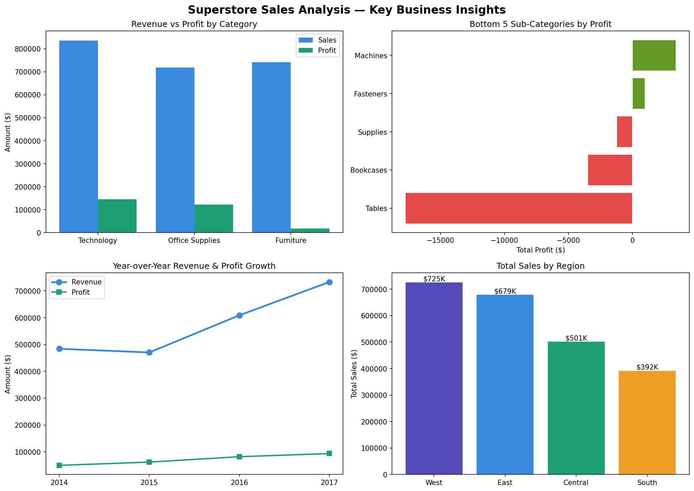

# Superstore Sales Analysis

## Business Problem
A US retail chain needed to understand which categories, regions, and 
sub-categories were driving profit — and which were silently losing money 
despite high sales volume.

## Tools Used
Python (Pandas, Matplotlib, Seaborn) | SQL (SQLite) | Excel

## Key Business Insights
- **Technology** is the most profitable category at 17.4% margin
- **Tables sub-category loses $17,725** despite generating $207K in sales
- **West region** leads with $725K total revenue across 1,611 orders
- Revenue grew from **$484K (2014) to $622K (2017)** — 28% growth
- **Bookcases also loss-making** at -$3,472 — furniture needs pricing review

## Business Recommendations
1. Discontinue or reprice Tables immediately — losing money on every sale
2. Review Bookcases pricing strategy — second worst performing sub-category  
3. Increase marketing budget for West region — highest revenue and profit
4. Investigate why South region has lowest orders (822) despite decent margin

## Dataset
[Sample Superstore — Kaggle](https://www.kaggle.com/datasets/vivek468/superstore-dataset-final)  
9,994 records | 21 columns | 2014–2017

## Dashboard Preview

## Files
- `notebooks/notebook.ipynb` — full analysis with SQL + Python
- `outputs/superstore_dashboard.png` — 4-chart visual summary