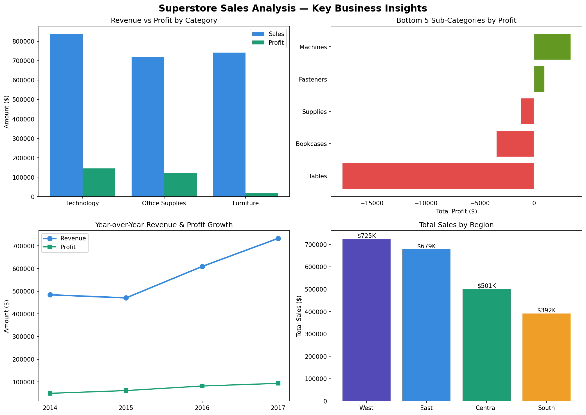

# Superstore Sales Analysis — Python + SQL

A comprehensive analysis of 10,000+ retail transactions using Python (Pandas, Matplotlib, Seaborn) and SQL (SQLite). Identifies profit drivers, hidden loss-making categories, and regional performance patterns.

## Business Problem

A US retail chain needed to understand which categories, regions, and sub-categories were driving profit — and which were silently losing money despite high sales volume.

## Tools Used

Python (Pandas, Matplotlib, Seaborn) · SQLite · Excel

## Key Business Insights

| Insight | Value |
|---------|-------|
| **Technology** | Most profitable category — 17.4% margin |
| **Tables sub-category** | Loses **$17,725** despite $207K in sales |
| **Bookcases** | Also loss-making at -$3,472 |
| **West region** | $725K revenue across 1,611 orders |
| **Revenue growth** | $484K (2014) → $622K (2017) — 28% increase |

## Business Recommendations

1. **Discontinue or reprice Tables** — losing money on every sale
2. **Review Bookcases pricing** — second worst performing sub-category
3. **Increase marketing in West region** — highest revenue and profit
4. **Investigate South region** — lowest orders (822) despite decent margin

## Files

| File | Description |
|------|-------------|
| `notebooks/notebook.ipynb` | Full analysis with SQL queries + Python visualisations |
| `outputs/superstore_dashboard.png` | 4-chart visual summary |
| `data/` | Source dataset (Sample Superstore) |

## Dashboard Preview

## Dataset

[Sample Superstore — Kaggle](https://www.kaggle.com/datasets/vivek468/superstore-dataset-final)  
9,994 records · 21 columns · 2014–2017

## Author

**Mittul Agarwal** — Data Specialist at YipitData

[LinkedIn](https://linkedin.com/in/mittul-agarwal-254a12209) · [GitHub](https://github.com/mittulagarwal)
